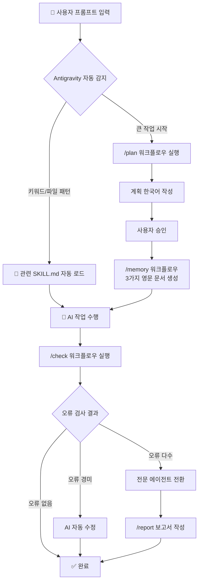

# AI 시스템 구축 계획서

> **프로젝트**: 디자인 패턴 학습 사이트 (Next.js 16 + Spring Boot 3)
> **AI 환경**: Google AI Pro — Antigravity (Gemini 3.1 / Claude Sonnet / Claude Opus)
> **목표**: AI 에이전트가 일관되고 고품질의 결과물을 생산하도록 매뉴얼 · 기억 · 품질 · 보고 체계를 구축

> [!CAUTION]
> **사전 필수 사항** — 이 계획서는 다른 작업소(workspace)에서 구현할 예정입니다.
> 구현을 시작하기 **전에** 반드시 `file/` 디렉토리의 참조 문서를 먼저 읽으세요.
>
> | 파일                | 내용                                                                 |
> | ------------------- | -------------------------------------------------------------------- |
> | `file/AI_System.md` | AI 시스템 설계 원본 — 4대 시스템(매뉴얼, 기억, 품질, 보고) 상세 설명 |
> | `file/project.md`   | 프로젝트 기술 스택, Git Convention, DB 스키마, Code Style 규칙       |
>
> 이 두 문서가 모든 스킬과 워크플로우의 **원천 자료**입니다.

---

## 핵심 차이점 — Antigravity vs Claude Code

> [!IMPORTANT]
> `AI_System.md`의 원본 설계는 **Claude Code의 Hook 기능**(PreToolUse, PostToolUse 등)에 의존합니다.
> Antigravity에는 Hook이 없으므로 **Skills 시스템**과 **Workflows**로 동일한 효과를 구현합니다.

| 원본 (Claude Code)                          | Antigravity 구현                                       |
| ------------------------------------------- | ------------------------------------------------------ |
| Hook → 키워드/의도 감지 후 매뉴얼 자동 주입 | **SKILL.md** YAML 메타데이터 → Antigravity가 자동 로드 |
| Hook → 파일 수정 시 변경 로그 기록          | **Workflow** 스크립트 + Git diff 기반 변경 추적        |
| Hook → 작업 완료 후 오류 자동 검사          | **Workflow** (`/check`) → lint/type-check 자동 실행    |
| Hook → 셀프 체크 리마인더 주입              | **SKILL.md** 내 체크리스트 자동 노출                   |

---

## 전체 디렉토리 구조

```
design-pattern-viz/                     # 모노레포 루트
│
├── .agent/
│   └── workflows/                      # Antigravity Workflows (루트 필수)
│       ├── plan.md                     # /plan — 계획 수립 워크플로우
│       ├── check.md                    # /check — 품질 검사 워크플로우
│       ├── report.md                   # /report — 보고서 작성 워크플로우
│       └── memory.md                   # /memory — 기억 문서 관리
│
├── frontend/                           # Next.js 프론트엔드
│   └── src/ public/ package.json ...
│
├── backend/                            # Spring Boot 백엔드
│   └── (Spring Boot 프로젝트 구조)
│
├── ai-system/                          # AI 에이전트 시스템
│   ├── .skills/
│   │   ├── skill-creator/              # 메타 스킬 — 새 스킬 생성 가이드
│   │   │   └── SKILL.md
│   │   │
│   │   ├── frontend/                   # FE 매뉴얼
│   │   │   ├── SKILL.md
│   │   │   ├── INDEX.md
│   │   │   └── chapters/
│   │   │       ├── nextjs-app-router.md
│   │   │       ├── fsd-architecture.md
│   │   │       └── styling-guide.md
│   │   │
│   │   ├── backend/                    # BE 매뉴얼
│   │   │   ├── SKILL.md
│   │   │   ├── INDEX.md
│   │   │   └── chapters/
│   │   │       ├── spring-boot-setup.md
│   │   │       ├── ddd-architecture.md
│   │   │       └── security-jwt.md
│   │   │
│   │   ├── database/                   # DB 매뉴얼
│   │   │   ├── SKILL.md
│   │   │   ├── INDEX.md
│   │   │   └── chapters/
│   │   │       ├── postgresql-schema.md
│   │   │       └── redis-config.md
│   │   │
│   │   ├── devops/                     # CI/CD & 배포 매뉴얼
│   │   │   ├── SKILL.md
│   │   │   ├── INDEX.md
│   │   │   └── chapters/
│   │   │       ├── docker-compose.md
│   │   │       └── aws-deploy.md
│   │   │
│   │   ├── quality-gate/               # 품질 검사 스킬
│   │   │   ├── SKILL.md
│   │   │   └── chapters/
│   │   │       ├── self-check-reminder.md
│   │   │       └── error-severity-guide.md
│   │   │
│   │   └── agents/                     # 전문 에이전트 스킬
│   │       ├── qa-agent/               # 품질관리팀
│   │       │   └── SKILL.md
│   │       ├── test-agent/             # 테스트팀
│   │       │   └── SKILL.md
│   │       └── planning-agent/         # 기획팀
│   │           └── SKILL.md
│   │
│   ├── .memory/                        # 작업 기억 시스템
│   │   └── .gitkeep
│   │
│   └── file/                           # 기존 참조 문서
│       ├── AI_System.md
│       └── project.md
│
├── .github/                            # CI/CD (루트 유지 — GitHub Actions 필수)
│   └── workflows/
│
├── .gitignore
├── CONVENTIONS.md                      # 프로젝트 전역 규칙 (Git, Code Style 등)
└── README.md
```

---

## Proposed Changes

### 1. 자동 매뉴얼 시스템 (Skills)

Antigravity는 `.skills/` 폴더의 `SKILL.md` 파일을 자동으로 인식합니다. YAML 프론트매터의 `name`과 `description`은 항상 컨텍스트에 로드되므로, 키워드 · 의도 · 작업 위치 기반 매뉴얼 활성화를 구현할 수 있습니다.

---

#### [NEW] [SKILL.md](file:///c:/Users/Lee/side-project/design-pattern-viz/ai-system/.skills/skill-creator/SKILL.md)

**메타 스킬** — 새로운 스킬을 만드는 방법을 AI에게 가르치는 스킬.

- 스킬 디렉토리 구조, YAML 형식, INDEX.md 작성법 포함
- `AI_System.md`에서 언급한 "스킬을 만드는 메타 스킬"

---

#### [NEW] [SKILL.md](file:///c:/Users/Lee/side-project/design-pattern-viz/ai-system/.skills/frontend/SKILL.md) + INDEX.md + chapters/

FE 매뉴얼 스킬:

- **SKILL.md**: `globs: ["**/app/**", "**/*.tsx", "**/*.ts", "**/components/**"]` 로 트리거
- **INDEX.md**: 목차 — Next.js 16 App Router, FSD 아키텍처, Tailwind + shadcn 스타일링
- **chapters/**: `project.md`의 FE 기술 스택 · 아키텍처 규칙을 영문으로 구조화

---

#### [NEW] [SKILL.md](file:///c:/Users/Lee/side-project/design-pattern-viz/ai-system/.skills/backend/SKILL.md) + INDEX.md + chapters/

BE 매뉴얼 스킬:

- **SKILL.md**: `globs: ["**/src/main/java/**", "**/*.java", "**/build.gradle*"]` 로 트리거
- **INDEX.md**: 목차 — Spring Boot 3, DDD, JWT + Spring Security
- **chapters/**: `project.md`의 BE 기술 스택 · 아키텍처 규칙을 영문으로 구조화

---

#### [NEW] [SKILL.md](file:///c:/Users/Lee/side-project/design-pattern-viz/ai-system/.skills/database/SKILL.md) + INDEX.md + chapters/

DB 매뉴얼 스킬:

- **SKILL.md**: `globs: ["**/*.sql", "**/entity/**", "**/repository/**"]`
- **chapters/**: PostgreSQL 스키마(DBML 기반), Redis Refresh Token 설정

---

#### [NEW] [SKILL.md](file:///c:/Users/Lee/side-project/design-pattern-viz/ai-system/.skills/devops/SKILL.md) + INDEX.md + chapters/

DevOps 매뉴얼 스킬:

- **SKILL.md**: `globs: ["**/docker-compose*", "**/Dockerfile*", "**/.github/**", "**/.env*"]`
- **chapters/**: Docker Compose, AWS EC2/RDS, Nginx, GitHub Actions

---

#### [NEW] [SKILL.md](file:///c:/Users/Lee/side-project/design-pattern-viz/ai-system/.skills/quality-gate/SKILL.md) + chapters/

품질 게이트 스킬:

- 셀프 체크 리마인더 체크리스트 포함
- 오류 심각도 가이드 (경미 → AI 자동수정 vs 중대 → 전문 에이전트 추천)

---

### 2. 작업 기억 시스템 (Working Memory)

#### [NEW] [memory.md](file:///c:/Users/Lee/side-project/design-pattern-viz/.agent/workflows/memory.md)

`/memory` 워크플로우 — 큰 작업 시작 시 3가지 영문 문서를 `ai-system/.memory/` 에 생성:

| 문서                    | 역할                             | 파일명 패턴              |
| ----------------------- | -------------------------------- | ------------------------ |
| Plan (계획서)           | 설계도 — 무엇을 만들 것인지      | `PLAN_{feature}.md`      |
| Context Note (맥락노트) | 시방서 — 왜 이렇게 결정했는지    | `CONTEXT_{feature}.md`   |
| Checklist (체크리스트)  | 공정표 — 뭘 끝냈고 뭐가 남았는지 | `CHECKLIST_{feature}.md` |

워크플로우 흐름:

1. AI가 계획을 **한국어**로 작성 → 사용자 검토
2. 승인 후 3가지 문서를 **영문**으로 `ai-system/.memory/` 에 저장
3. "문서 저장 후 멈춤" — 새로운 대화에서 이어서 작업

---

#### [NEW] [plan.md](file:///c:/Users/Lee/side-project/design-pattern-viz/.agent/workflows/plan.md)

`/plan` 워크플로우 — 새 기능/큰 변경 시작 전 계획 수립 강제:

1. 현재 상태 분석
2. 한국어로 계획 작성
3. 사용자 승인 대기
4. `/memory` 호출하여 문서 저장

---

### 3. 자동 품질 검사 시스템

#### [NEW] [check.md](file:///c:/Users/Lee/side-project/design-pattern-viz/.agent/workflows/check.md)

`/check` 워크플로우 — 작업 완료 후 실행:

```
1. Git diff로 변경된 파일 목록 수집
2. FE 변경 시: cd frontend && npx eslint + npx tsc --noEmit
3. BE 변경 시: cd backend && ./gradlew spotlessCheck + ./gradlew compileJava
4. 셀프 체크 리마인더 출력
   - "오류 처리(try-catch)는 추가했나요?"
   - "보안상 위험한 부분은 없나요?"
   - "타입 정의는 올바른가요?"
5. 오류가 적으면 → AI 자동 수정 시도
6. 오류가 많으면 → 전문 에이전트 추천
```

---

### 4. 전문 에이전트 (보고 체계)

#### [NEW] [SKILL.md](file:///c:/Users/Lee/side-project/design-pattern-viz/ai-system/.skills/agents/qa-agent/SKILL.md)

**품질관리팀 에이전트**:

- 역할: 코드 검토, 오류 수정, 구조 개선 (정적 분석)
- 보고서 양식: 발견 → 수정 → 판단 근거
- 트리거: `/check` 워크플로우에서 오류 다수 발견 시 전환

---

#### [NEW] [SKILL.md](file:///c:/Users/Lee/side-project/design-pattern-viz/ai-system/.skills/agents/test-agent/SKILL.md)

**테스트팀 에이전트**:

- 역할: 기능 테스트 및 검증, 런타임 오류 진단, 화면 확인
- FE: Playwright/Vitest, BE: JUnit + MockMvc
- 보고서 양식: 테스트 결과 → 실패 원인 → 수정 제안

---

#### [NEW] [SKILL.md](file:///c:/Users/Lee/side-project/design-pattern-viz/ai-system/.skills/agents/planning-agent/SKILL.md)

**기획팀 에이전트**:

- 역할: 계획 수립, 검토 문서 작성 (코드 수정 금지)
- 보고서 양식: 요구사항 분석 → 구현 계획 → 리스크 평가

---

#### [NEW] [report.md](file:///c:/Users/Lee/side-project/design-pattern-viz/.agent/workflows/report.md)

`/report` 워크플로우 — 에이전트 보고서 작성 강제:

```
1. 무엇을 발견했는지
2. 무엇을 수정했는지
3. 왜 그렇게 판단했는지
```

보고서는 `ai-system/.memory/reports/` 에 저장

---

### 5. 프로젝트 전역 규칙

#### [NEW] [CONVENTIONS.md](file:///c:/Users/Lee/side-project/design-pattern-viz/CONVENTIONS.md) (모노레포 루트)

`project.md`의 Git Convention, Code Style 규칙을 Antigravity가 자동 인식하는 형태로 정리:

- Git 커밋 메시지 규칙 (feat, fix, docs, style, refactor, test, chore)
- FE: ESLint 준수, BE: Spotless 준수
- 한국어 계획서 → 영문 문서 변환 원칙

---

## 시스템 흐름도



---

## 구현 순서

| 단계 | 작업                                                               | 우선순위 |
| :--: | ------------------------------------------------------------------ | :------: |
|  1   | `CONVENTIONS.md`(루트) + `ai-system/.memory/` 디렉토리 생성        | 🔴 높음  |
|  2   | `ai-system/.skills/skill-creator/` 메타 스킬 생성                  | 🔴 높음  |
|  3   | `.agent/workflows/`(루트) — `plan.md`, `memory.md`                 | 🔴 높음  |
|  4   | `ai-system/.skills/frontend/`, `ai-system/.skills/backend/` 매뉴얼 | 🟡 중간  |
|  5   | `ai-system/.skills/database/`, `ai-system/.skills/devops/` 매뉴얼  | 🟡 중간  |
|  6   | `.agent/workflows/check.md`(루트) 품질 검사                        | 🟡 중간  |
|  7   | `ai-system/.skills/quality-gate/` + 셀프 체크 리마인더             | 🟡 중간  |
|  8   | `ai-system/.skills/agents/` 전문 에이전트 3종                      | 🟢 낮음  |
|  9   | `.agent/workflows/report.md`(루트) 보고서 체계                     | 🟢 낮음  |

---

## 확정 사항 ✅

> [!NOTE]
> 이 시스템은 **Antigravity 전용**으로 설계되었습니다. Claude Code의 Hook 기능은 사용하지 않습니다.
> 아래 5가지 항목은 **사용자 승인 완료**되었습니다. (2026-02-23)

|  #  | 결정 사항              | 확정 내용                                       |
| :-: | ---------------------- | ----------------------------------------------- |
|  1  | **스킬 디렉토리 위치** | `ai-system/.skills/` → `ai-system/` 하위에 배치 |
|  2  | **매뉴얼 영역**        | **FE / BE / DB / DevOps** 4개 영역으로 분리     |
|  3  | **에이전트 팀 구성**   | **품질관리팀 / 테스트팀 / 기획팀** 3개 팀       |
|  4  | **워크플로우 명령어**  | `/plan`, `/memory`, `/check`, `/report` 4개     |
|  5  | **기술 스택 반영**     | `project.md` 내용을 각 스킬에 **그대로 반영**   |

---

## Verification Plan

### 자동 검증

1. **스킬 인식 테스트**: `ai-system/.skills/` 디렉토리 생성 후, Antigravity가 SKILL.md를 로드하는지 확인
   - 실행: 새 대화에서 FE 관련 질문 → 프론트엔드 스킬이 컨텍스트에 포함되었는지 확인
2. **워크플로우 실행 테스트**: `/plan` 입력 시 워크플로우가 실행되는지 확인
   - 실행: `/plan` 커맨드 실행 → 계획 수립 프로세스 시작 여부 확인

### 수동 검증 (사용자)

1. 각 SKILL.md를 열어 YAML 메타데이터가 올바른지 검토
2. `/check` 워크플로우 실행 후 lint/type-check 결과가 올바르게 출력되는지 확인
3. `ai-system/.memory/` 에 생성된 문서(Plan, Context, Checklist)가 의도대로 작성되었는지 검토
